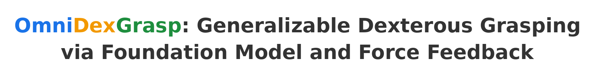
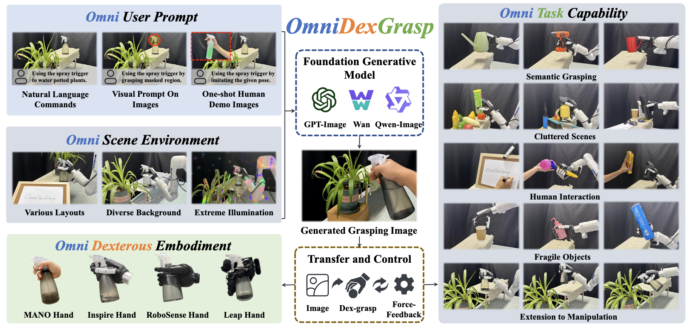
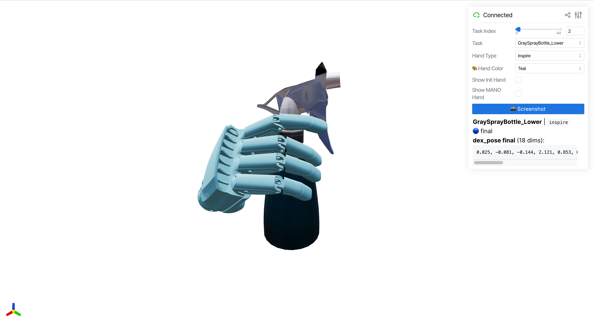

<div align="center">



<h3>Accepted to ICRA 2026</h3>

<h4>
<a href="https://wyl2077.github.io/">Yi-Lin Wei</a><sup>&#42;</sup>,
<a href="https://zhexiluo.github.io/">Zhexi Luo</a><sup>&#42;</sup>,
Yuhao Lin,
<a href="https://frenkielm.github.io/">Mu Lin</a>,
Zhizhao Liang,
<a href="https://github.com/Rain-Shuoyu">Shuoyu Chen</a>,
<a href="https://www.isee-ai.cn/~zhwshi/">Wei-Shi Zheng</a><sup>†</sup>
</h4>

<sup>&#42;</sup>Equal contribution &nbsp; <sup>†</sup>Corresponding author


<a href="https://arxiv.org/abs/2510.23119">
    </a>
<a href="https://isee-laboratory.github.io/OmniDexGrasp/">
    </a>



</div>

## 📢 News

- 🚧 *Coming soon...*

## 📝 TODO

⬜ Support more dexterous hand types

⬜ One-click online demo

## 📑 Table of Contents

- [🛠️ Installation](#installation)
- [📋 Prerequisites](#prerequisites)
- [▶️ Usage](#usage)
- [🧩 Bring Your Own Data](#custom-data)
- [📄 Citation](#citation)
- [📜 License](#license)
- [🙏 Acknowledgement](#acknowledgement)


## 🛠️ Installation

<a id="installation"></a>

<details>
<summary><b>Installation</b></summary>

```bash
# 1. Clone the repository
git clone --recursive https://github.com/ISEE-Laboratory/OmniDexGrasp.git
cd OmniDexGrasp

# 2. Initialize submodules (if not cloned with --recursive)
git submodule update --init --recursive
```

Due to unresolved dependency conflicts between submodules, multiple conda environments are required:

| Conda Env | Module | Reference |
|-----------|--------|-----------|
| `omnidexgrasp` | This repository | See instructions below |
| `hamer` | HaMeR hand estimation | [geopavlakos/hamer](https://github.com/geopavlakos/hamer) |
| `gsam` | Grounded-SAM-2 segmentation | [IDEA-Research/Grounded-SAM-2](https://github.com/IDEA-Research/Grounded-SAM-2) |
| `megapose` | MegaPose6D pose estimation | [megapose6d/megapose6d](https://github.com/megapose6d/megapose6d) |

For `hamer`, `gsam`, and `megapose`, please refer to their official documentation for installation.

**Setting up the `omnidexgrasp` environment:**

```bash
# 1. Create conda environment
conda create -n omnidexgrasp python=3.10 -y
conda activate omnidexgrasp

# 2. Install PyTorch with CUDA 12.8
pip install torch torchvision --index-url https://download.pytorch.org/whl/cu128

# 3. Install PyTorch3D
conda install -c conda-forge iopath fvcore -y
pip install --no-build-isolation "git+https://github.com/facebookresearch/pytorch3d.git"

# 4. Install nvdiffrast 
git clone https://github.com/NVlabs/nvdiffrast.git /tmp/nvdiffrast
cd /tmp/nvdiffrast && pip install . --no-build-isolation && cd -

# 5. Install project dependencies (includes manotorch, chamfer-distance, etc.)
pip install -r requirements.txt

# 6. Install CSDF (https://github.com/wrc042/CSDF)
git clone https://github.com/wrc042/CSDF.git omnidexgrasp/thirdparty/CSDF
cd omnidexgrasp/thirdparty/CSDF
pip install -e . --no-build-isolation
cd ../../..

# 7. Install EasyHOI
cd omnidexgrasp/thirdparty/EasyHOI
pip install -e .
cd ../../..
```

> **Note:** Building CSDF, PyTorch3D and nvdiffrast from source requires CUDA toolkit. Ensure `nvcc` is available in your PATH.

**Setting up server environments (`hamer`, `gsam`):**

After configuring each environment following their official documentation, install the server dependencies:

```bash
# In each server environment (hamer / gsam)
pip install fastapi uvicorn pydantic hydra-core omegaconf
```

</details>


## 📋 Prerequisites

<a id="prerequisites"></a>

<details>
<summary><b>Download Assets, Checkpoints & Dataset</b></summary>

```
OmniDexGrasp/
├── assets/
│   ├── mano/models/                # MANO hand model
│   │   ├── MANO_RIGHT.pkl
│   │   └── mano_mean_params.npz
│   └── robo/                       ✅ Included in repo
├── datasets/                      # Download HuggingFace dataset here
└── checkpoints/
    ├── hamer/                      # HaMeR + ViTPose + Detectron2
    │   ├── hamer_ckpts/checkpoints/hamer.ckpt
    │   ├── vitpose_ckpts/vitpose+_huge/wholebody.pth
    │   └── detectron2/model_final_f05665.pkl
    └── gsam2/                      # Grounded-SAM-2
        ├── sam2.1_hiera_base_plus.pt
        └── grounding-dino-base/
```

### Download dataset from HuggingFace

The dataset is available at: https://huggingface.co/datasets/wyl2077/OmniDexGrasp

Download it into the local `datasets/` folder before running the code.

Example using `huggingface_hub`:

```bash
pip install huggingface_hub
python - <<'PY'
from huggingface_hub import snapshot_download
snapshot_download(
    repo_id='wyl2077/OmniDexGrasp',
    repo_type='dataset',
    local_dir='datasets',
    allow_patterns=['*'],
    ignore_patterns=['.git']
)
PY
```

If you prefer the HuggingFace web UI, download the dataset files manually and place them under `datasets/`.

Download checkpoints following the official documentation of each submodule:
[geopavlakos/hamer](https://github.com/geopavlakos/hamer) |
[IDEA-Research/Grounded-SAM-2](https://github.com/IDEA-Research/Grounded-SAM-2) |
[megapose6d/megapose6d](https://github.com/megapose6d/megapose6d)

MANO hand model requires registration at [mano.is.tue.mpg.de](https://mano.is.tue.mpg.de/).

</details>


## ▶️ Usage

<a id="usage"></a>

### 🍵 Stage 1: Reconstruction

Reconstruct 3D hand and object from input images. All commands run from the `omnidexgrasp/` directory.

**Phase 1: Hand & Object Reconstruction**

```bash
# Terminal 1: Start HaMeR server
conda activate hamer
python -m recons.server.hamer

# Terminal 2: Start GSAM server
conda activate gsam
python -m recons.server.gsam

# Main Terminal: Run reconstruction client
conda activate omnidexgrasp
python -m recons.client
```

**Phase 2: Object Pose Estimation**

```bash
# Kill the HaMeR & GSAM servers first to free VRAM, then:
conda activate megapose
python -m recons.pose_est
```

> **Note:** Loading all models simultaneously requires >24GB VRAM, exceeding a single RTX 4090. We split reconstruction into two phases — kill the servers before running pose estimation to free VRAM.

### 🤚 Stage 2: Hand Pose Optimization

**Refine the reconstructed hand pose to achieve physically plausible hand-object interaction.**

```bash
conda activate omnidexgrasp
python -m optim.main
```

### 🤖 Stage 3: Human-to-Robot Retargeting

**Map human hand pose to dexterous robot hands**
```bash
conda activate omnidexgrasp
python -m human2robo.main
# Specify hand types:
python -m human2robo.main hand_types=[inspire,wuji,shadow]
```

### 👁️ Visualization

Visualize the retargeting results interactively.

```bash
conda activate omnidexgrasp
python -m scripts.vis_dexgrasp --output ../out --port 8080
```

Expected output: an interactive 3D viewer to browse tasks, switch hand types, and inspect grasp poses.




## 🧩 Bring Your Own Data

<a id="custom-data"></a>

<details>
<summary><b>Data Preparation Guide</b></summary>

To run OmniDexGrasp on your own objects, prepare the following files for each grasp instance under `datasets/{task_name}/`:

**1. Capture Scene Image & Depth**

Use an RGB-D camera (e.g., Intel RealSense D435) to capture:
- `scene_image.png` — RGB image of the object
- `depth.png` — Aligned depth map
- `camera.yaml` — Camera intrinsics

Our method is agnostic to the specific depth camera model.

**2. Obtain Object Mesh**

We use [Hyper3D](https://hyper3d.ai/) to reconstruct the object mesh, producing:
- `base.obj` — Object mesh
- `material.mtl` — Material file
- `shaded.png` — Texture map

You can also use open-source alternatives such as [TRELLIS.2](https://github.com/microsoft/TRELLIS.2).

**3. Generate Grasp Image**

We recommend using [gpt-image-1](https://platform.openai.com/docs/guides/image-generation) or [gemini-3-pro-image](https://ai.google.dev/gemini-api/docs/image-generation) to generate `generated_human_grasp.png` — a synthetic image depicting a human hand grasping the object.

For best results, ensure the generated image matches the aspect ratio of the original `scene_image.png`.

</details>


## 📄 Citation

<a id="citation"></a>

If you find this work useful, please consider citing:

```bibtex
@inproceedings{wei2026omnidexgrasp,
  title={OmniDexGrasp: Generalizable Dexterous Grasping via Foundation Model and Force Feedback},
  author={Wei, Yi-Lin and Luo, Zhexi and Lin, Yuhao and Lin, Mu and Liang, Zhizhao and Chen, Shuoyu and Zheng, Wei-Shi},
  booktitle={IEEE International Conference on Robotics and Automation (ICRA)},
  year={2026}
}
```


## 📜 License

<a id="license"></a>

This project is released under the [Apache License 2.0](LICENSE).

## ⭐ Star History

<div align="center">

[](https://star-history.com/#ISEE-Laboratory/OmniDexGrasp&Date)

</div>

## 🙏 Acknowledgement

<a id="acknowledgement"></a>

We thank the following open-source projects for their valuable contributions to the community:
- [HaMeR](https://github.com/geopavlakos/hamer)
- [Grounded-SAM-2](https://github.com/IDEA-Research/Grounded-SAM-2)
- [EasyHOI](https://github.com/lym29/EasyHOI)
- [MegaPose6D](https://github.com/megapose6d/megapose6d)
